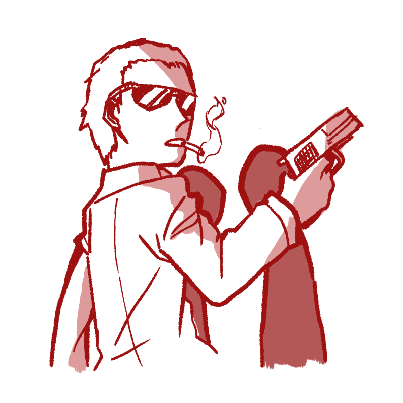
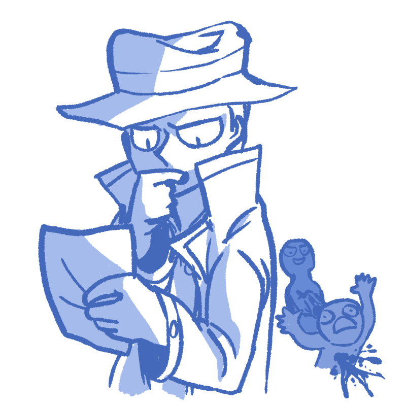

# Mafioso - A Mafia Bot for Discord

## Table of Contents

1. [What is it?](#what-is-it)
2. [Why make it?](#why-make-it)
3. [Key Features](#key-features)
4. [Rules](#rules)
    - [Getting Started](#getting-started)
    - [Creating, Joining and Starting a Game](#creating-joining-and-starting-a-game)
    - [Roles](#roles)
    - [Night Time](#night-time)
    - [Day Time](#day-time)
    - [Last Stand](#last-stand)
    - [Dying](#dying)
5. [Who are we?](#who-are-we)

## What is it?
Mafioso is a [Discord](https://discord.gg) bot made for [Discord Hack Week](https://discordapp.com/invite/hackweek).

The bot plays Mafia, a multiplayer game of expectations and betrayal, which can be really fun.
If you've never played Mafia before, I suggest you give it a try, bot or not.
The real life rules can be found [here](https://icebreakerideas.com/mafia-game/).

However, this bot aims to address some of the pitfalls my friends and I have found while playing Mafia.
It serves as a moderator for the game, enforces rules, generates stories and hopefully increases how much fun you have while playing the game.

Looking to [playtest](https://discord.gg/zfZjw4R)?

Looking to [add it to your server](https://discordapp.com/oauth2/authorize?client_id=592865254086541322&scope=bot&permissions=474033168)?

## Why make it?
The entire development team loves Mafia, but there are some issues we found that we thought we could tackle by making a Discord bot.
Let's address some pitfalls we encounter while playing regular Mafia:
 - One person always has to serve as moderator.
   - You can't properly play when you don't have many people, since one person will always have to play moderator.
   - One person always has to sit out whether they like it or not, to assign roles and keep the game going. That's no fun!
 - People can often hold up games by forgetting or not speaking.
 - Moderators frequently have to speak to each person 1 by 1 during each night, which can make large games very slow.
 - Some Mafia games don't have fun roles, or the roles are too difficult to keep track of by a moderator.
   - For example, if an investigator asks you (the moderator) if a certain person is Mafia but you totally forgot, what do you do?

As Mafia connoisseurs, we have also played on Discord. We also found some special issues with playing Mafia over voice call.
 - To give the Mafia a chance to send their role to the moderator, everyone has to mute!
   - Not just one person, because then it would blow their cover.
   - This almost never happens! And when it does, it takes a good minute and a half.

tl;dr Regular Mafia is a flawed game and the power of technology is the solution!

## Key Features
Here are some key features the bot offers to solve these problems:
 - The complete Mafia experience.
    - Day, night, voting out, last stand, everything we could think of.
 - Fully capable moderation of several different games at once.
 - 5 Unique Roles.
 - Voice channel support, for silencing and muting members (surprisingly handy).
 - Randomized stories.
    - For that extra bit of moderation punch.
 - Art that pops out at you like a tasty sandwich.

tl;dr Strong bot indeed.

## Rules
We tried to make the bot as easy and intuitive as possible to use, but in case you get lost in this vast trek we included the rules are here to help you get back on track.

### Getting Started
Say you've just [invited the bot](https://discordapp.com/oauth2/authorize?client_id=592865254086541322&scope=bot&permissions=474033168) to your server.
The first thing you need to do is run the `-setup` command.
This will create a Mafia category, with `#general` and `#mafia` chats along with a voice chat.
The bot does not automatically set up in order to not surprise you with freaky Mafia channels right off the bat.

If you're an administrator, you will have access to the `#mafia` channel no matter what.
Play fair and mute that channel ASAP.
Don't worry, if you're part of the Mafia the bot will ping you first.

### Creating, Joining and Starting a Game
After setting up, you can create a new game lobby with `-create`.
Afterwards, each player who would like to join needs to use the `-join` command to join the lobby.
Once everyone has joined, and you are ready to start, send `-start` to begin the game.

The bot should send everyone your roles in a few seconds, and the game should start off in night time.
If you're confused why you've been muted, check out the "Night Time" section.

### Roles

#### Citizen


**Objective**: Vote out all the Mafia.

**Strength**: Sheer number.

**Friendly Roles**: Citizens, Detectives, Doctors

As a citizen, you aren't especially special.
You don't have any special ability you can use during the night.
The only thing you know is that the Mafia is plotting to take over the town, and you need to stop it.

Work with other friendly roles to find the Mafia and vote them out during the day through the power of democracy.
For more on voting, see the "Day Time" section.

#### Mafia


**Objective**: Have Mafia become majority of game (>50% of players are Mafia).

**Strength**: Able to attack 1 Non-Mafia each night.

**Friendly Roles**: Mafia

The Mafia wants to take over the town.
How? Killing during the night and deceiving during the day.
Each night, you and your fellow Mafia (if you are not the only Mafia) vote with `-vote` in the `#mafia` channel.
**Only** the person with the majority of votes will be found dead the next morning (spooky).

You can also lie and deceive during the morning to convince the town to vote innocent individuals out.
However, watch out. The Detective is constantly looking for you, and the Doctor can save the people you attack.
Choose wisely.

#### Doctor

**Objective**: Vote out all the Mafia.

**Strength**: Able to pick 1 person to save each night.

**Friendly Roles**: Citizens, Detectives, Doctors

You've kept your medical license a secret from the town.
Each night, you stake out someone's house to save them if they get attacked by the Mafia.
You can select the person you want to save through DMs with the bot with the `-select <number>` command.

Keep in mind that you aren't able to save the same person twice in a row.
You are also able to save yourself, but also not twice in a row.

While your role can be especially powerful, it can also be dangerous.
The Mafia is hunting you down, and if you aren't careful- you might not live much longer.

#### Detective


**Objective**: Vote out all the Mafia.

**Strength**: Able to pick 1 person to investigate each night.

**Friendly Roles**: Citizens, Detectives, Doctors

As a professional investigator, you are very observant.
Each night, the bot will DM you a list of people you can investigate.
You can pick an option with `-select <number>`.

The bot will then DM you your investigation results.
Here's a table of what roles your results might mean.

Target Seems Normal | Target Seems Suspicious
--- | ---
Citizen | Mafia
Doctor | Silencer
Detective | Hunter

Beware, as the Mafia is trying to hunt you down.
Only reveal your role when it is of the essence.

#### Silencer

**Objective**: Stay alive until the end of the game.

**Strength**: Able to pick 1 person to completely silence each night.

**Friendly Roles**: No one.

You keep people quiet.
You will be asked to select someone with `-select <number>` each night through DMs with the bot.
The person you have selected will not be able to speak the next morning.
They won't be able to vote either, nor talk in voice chat.
They will be able to speak the next day.

The silencer can side with the Citizens or the Mafia, it is their choice.
However, if a detective investigates you- you will look suspicious.
I'm sure the town will understand if you explain that you're working for them... but will you really?

#### Hunter

**Objective**: Stay alive until the end of the game.

**Strength**: Able to pick a person to stalk and kill.

**Friendly Roles**: No one.

You are a crazy serial killer that feels nothing for everyone else in the game.
If you didn't stalk anyone the night before, you will be asked who you want to stalk.
You can select who you want to stalk with `-select <number>` where number is the number of the individual you want to stalk.
You spend the night observing the person you stalk and you learn their exact role.

However, the night after stalking someone, you will find the person you stalked and kill them.
This will take up the whole night.

As a Hunter, we hope that you will be able to make investigator claims and trick the town into trusting you.
We also hope introducing a new killer into larger games can make the game more interesting.

### Night Time
Night Time lasts approximately 60 seconds. In this time, everyone frantically tells the bot who they will target.

Most Non-Mafia roles will be DMed a list of names they can target.
They will have to DM back `-select <number>` where \<number\> is the number of the individual they want to target.
They can only do this once.

The Mafia are sent a similar list in their `#mafia` channel.
They need to vote for the individual they are going to kill with the `-vote <number>` command.
\<number\> is the number of the individual they want to target.
If there is a majority vote, that person will be selected to be attacked.
If not, the Mafia will stay home and eat popcorn.

If everyone has finished voting and selecting, the night will end immediately and "Day Time" will begin.

### Day Time
During day time, there will be a short 30 second discussion period where everyone can share their information.

Then, a vote will be called.
The bot will DM a list in `#general` and you can vote by typing `-vote <number>` where number is the number of the individual you want to target.
If there is a majority vote, the individual will be put on "Last Stand."
If there is not, it will go straight to night time.

The Mafia may try to influence the vote with lies, so be careful!

### Last Stand
If someone is put on their last stand, they will be given 20 seconds of pure silence to help them defend themselves.
Then, the voting commences. Type `-vote 1` for innocent and `-vote 2` for guilty.

If more people vote innocent than guilty or if there is a tie, they will be acquitted.
If most people vote guilty, they will be killed.

After the Last Stand, the game will go straight to "Night Time."

### Dying
If you are dead, you will have access to the `#dead` chat.
You will not be able to speak in `#general` or `#mafia`.
You will not be able to speak in voice chat.
You will also have a shiny role.

Dying usually means you lose the game. Don't do it.

### Custom Games
Ever wanted to make your own games? Well we added the `-config` command to do just that.
Maybe you want to increase the amount of Mafia during your next game.
Maybe you're crazy and you want to play a game with 5 Silencers and 4 Mafia.
Either way, we got you covered.

Running `-config` by itself will show you what the current game config is.
We optimized it to be as scalable and fun as possible for us through many playtests, but maybe not for you.
You can change how many of each role you have in this lobby by adding some stuff at the end of the command.

#### Simplest Config
By adding a several `number role` combos after `-config` you can manipulate the amount of each role.
Sounds confusing? Here are some examples:

Custom game with 2 mafia, a hunter and a detective.
```
-config 2 mafia 1 hunter 1 detective
```

Configs can also take the number and role in any order, have commas and colons and even aliases to the roles.

Oh boy, I hope they don't pick me. - 
Custom game with 5 detectives and 1 mafia.
```
-config investigators: 5, 1 mafia
```

Be quiet! -
Custom game with 3 mafia, 5 silencers and 2 detectives.
```
-config mafias 3 5 silencers, detectives: 2
```

tl;dr Whatever you type after the `-config`, it's probably going to work.

#### Advanced Configs
You can make configs scale as the number of players increase or decrease.
This isn't totally simple but I thought I would explain it here.
We use this for the default config so it can scale, but if you don't understand- you're not missing out on much.

Instead of the number option, you can put a percentage.
The percentage specified will be the percent of players in that game that will have that role.

Custom game where 20% of players will be mafia.
```
-custom 20% mafia
```

You can also prefix the number with a `+` to round up or a `-` to round down.

Custom game where 25% of players will be mafia (rounded up) and 20% will be detectives (rounded down).
```
-custom +25% mafia -20% detective
```

tl;dr Configs can be complicated but if you study enough you can reuse them for all sorts of games.

## Who are we?
The development team consists of these nerds:
 - **desgroup**, maker of features
 - **0S E0**, renowned writer and artist
 - **LazerHD**, adding that extra spice
 - **Ichorice Malign**, second amazing artist
 - **azharap23**, third amazing artist
 
And also a big get better soon to **0S E0**.

A special thanks to all the playtesters that kept on finding innovative new ways to break the bot (by usernames):
 - BluPheonix138
 - NoX
 - caspinprince
 - Alibaba
 - Hockey_Man
 - Lord Donut
 - Tan
 - Gonsailing
 - Bubblesimpi
 - LunarCoffee
 - Nicaninja
 - soupicide
 
 You are all awesome and this project would not have gotten very far without you!